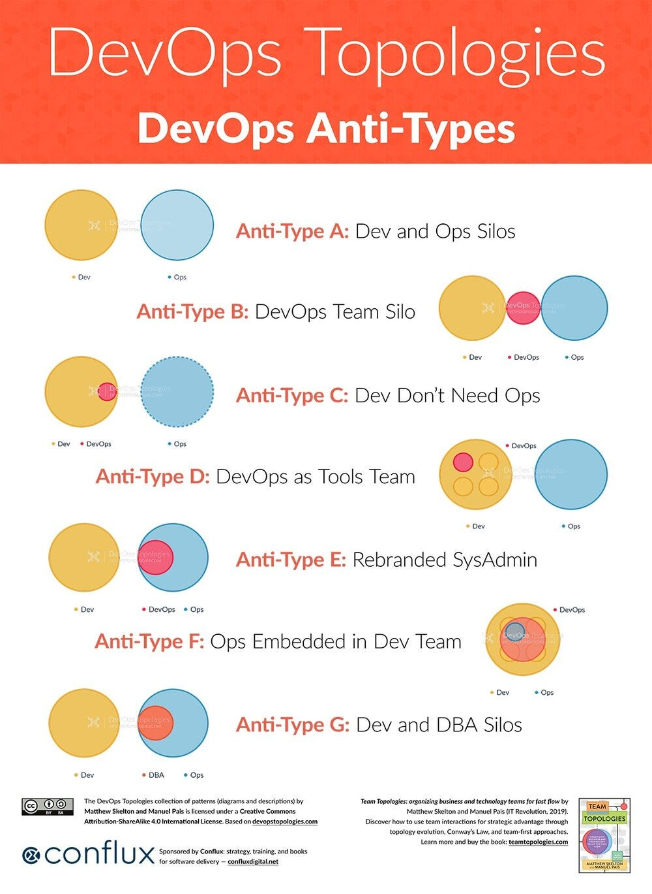

# Introducción devops, devsecops
Maurizio Berdiales Díaz - 20202113E

Según las fuentes consultadas en FUENTES.md, **DevOps** es la unión de personas, procesos, y tecnología para promover valor continuo a los clientes. 

Para Microsoft, a **DevSecOps** se le define como la integración de prácticas de seguridad dentro del procesos DevOps, se crea una cultura de "seguridad como código" con colaboración continua entre ingenieros de despliegue y equipos de seguridad. Una definición que se tiene muy clara desde las sesiones de clase.

Con respecto a **CI/CD**, se refiere a la **integración continua** como la práctica de fusionar todos los cambios de código en un repositorio central de manera frecuente, seguido de complicaiones y pruebas automáticas. A su vez, la **entrega continua** es una extensión de la integración continua que asegura al softrware de poder ser lanzado de manera confiable, sin importar el momento en el que se haga.

Finalmente, Accelerate da la siguiente definición de **Agile**: El desarrollo ágil de software es un enfoque iterativo que se centra en la colaboración , la retroalimentación del cliente y entregas pequeñas y rápidas. En mi entendimiento, estas prácticas de gestión ayudan a que los **objetivos sean claros para todos los miembros del proceso de desarrollo, calidad y despliegue**. A su vez se alinean perfectamente con las necesidades del cliente.

## DevOps vs cascada

El modelo en cascada sigue una secuencia rígida: primero se recogen requisitos, luego se diseña, se implementa, se prueba y finalmente se despliega. Esto suele generar largos tiempos de espera, poca retroalimentación y riesgos altos si algo falla al final.

DevOps, en cambio, se apoya en la integración continua y la colaboración constante entre desarrollo y operaciones. Esto permite ciclos más cortos, retroalimentación rápida y entregas incrementales.

Trade-off verificable:

    - Cascada: más predecible en entornos estables, pero muy costoso frente a cambios.

    - DevOps: más flexible y adaptable, pero requiere inversión inicial en automatización y cambios culturales.

Se observa cómo en Waterfall, se usa solo un pequeño espacio y recursos para el despliegue del software, mientras que DevOps realiza ese trabajo continuamente, lo que le permite tener mejor mapeados los errores que puedan aparecer.

## Silos y anti-patrones

En muchas organizaciones tradicionales, los equipos trabajan en silos: desarrollo, operaciones, seguridad y negocio separados, con comunicación mínima. Esto retrasa entregas y genera conflictos de responsabilidades.

Los anti-patrones son prácticas que parecen útiles pero resultan dañinas. Ejemplos en DevOps incluyen:

    - “Entregar y olvidar”: el equipo de desarrollo lanza el software y se desentiende.

    - “Automatizar por automatizar”: invertir en herramientas sin un objetivo claro.

    - “DevOps como un rol único”: contratar a un “ingeniero DevOps” en lugar de adoptar la cultura en todo el equipo.

Trade-off verificable:

    - Silos: dan claridad de funciones, pero reducen la colaboración y retrasan entregas.

    - Romper silos con DevOps: mejora la agilidad, pero exige coordinación constante y responsabilidades compartidas.

## Principios y beneficios

Los principios de DevOps incluyen:

    - **Colaboración** continua entre todas las áreas.

    - **Automatización** de pruebas, despliegues y monitoreo.

    - **Retroalimentación** rápida para detectar y corregir errores antes de llegar a producción.

    - **Entrega incremental de valor** al usuario.

Los beneficios más directos son:

    - **Reducción** de tiempos de entrega.

    - Mayor **calidad** del software.

    - Capacidad de **responder rápidamente a cambios** del mercado o requisitos del cliente.

Indicador observable:

    - Tiempo medio de entrega (Lead Time for Changes) que usaremos como KPI. Cómo medirlo: calcular el **tiempo promedio entre que un cambio de código se confirma en el repositorio (commit) y el momento en que se despliega en producción**. Un menor tiempo indica una mayor eficiencia del proceso DevOps.
