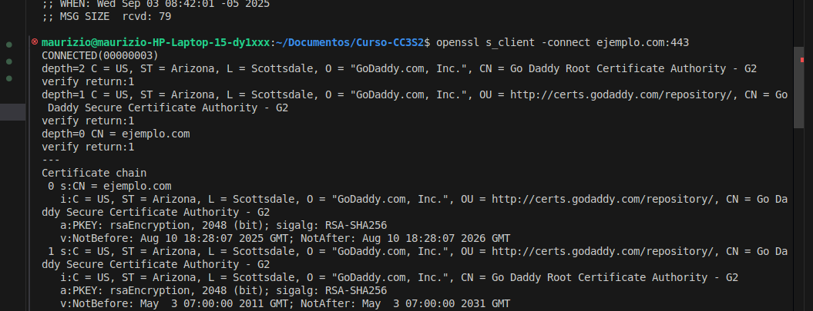

# Introducción devops, devsecops
Maurizio Berdiales Díaz - 20202113E
4 horas

Según las fuentes consultadas en FUENTES.md, **DevOps** es la unión de personas, procesos, y tecnología para promover valor continuo a los clientes. 

Para Microsoft, a **DevSecOps** se le define como la integración de prácticas de seguridad dentro del procesos DevOps, se crea una cultura de "seguridad como código" con colaboración continua entre ingenieros de despliegue y equipos de seguridad. Una definición que se tiene muy clara desde las sesiones de clase.

Con respecto a **CI/CD**, se refiere a la **integración continua** como la práctica de fusionar todos los cambios de código en un repositorio central de manera frecuente, seguido de complicaiones y pruebas automáticas. A su vez, la **entrega continua** es una extensión de la integración continua que asegura al softrware de poder ser lanzado de manera confiable, sin importar el momento en el que se haga.

Finalmente, Accelerate da la siguiente definición de **Agile**: El desarrollo ágil de software es un enfoque iterativo que se centra en la colaboración , la retroalimentación del cliente y entregas pequeñas y rápidas. En mi entendimiento, estas prácticas de gestión ayudan a que los **objetivos sean claros para todos los miembros del proceso de desarrollo, calidad y despliegue**. A su vez se alinean perfectamente con las necesidades del cliente.

## DevOps vs cascada

El modelo en cascada sigue una secuencia rígida: primero se recogen requisitos, luego se diseña, se implementa, se prueba y finalmente se despliega. Esto suele generar largos tiempos de espera, poca retroalimentación y riesgos altos si algo falla al final.

DevOps, en cambio, se apoya en la integración continua y la colaboración constante entre desarrollo y operaciones. Esto permite ciclos más cortos, retroalimentación rápida y entregas incrementales.

Trade-off verificable:

Cascada: más predecible en entornos estables, pero muy costoso frente a cambios.

DevOps: más flexible y adaptable, pero requiere inversión inicial en automatización y cambios culturales.

Se observa cómo en Waterfall, se usa solo un pequeño espacio y recursos para el despliegue del software, mientras que DevOps realiza ese trabajo continuamente, lo que le permite tener mejor mapeados los errores que puedan aparecer.

## Silos y anti-patrones

En muchas organizaciones tradicionales, los equipos trabajan en silos: desarrollo, operaciones, seguridad y negocio separados, con comunicación mínima. Esto retrasa entregas y genera conflictos de responsabilidades.

Los anti-patrones son prácticas que parecen útiles pero resultan dañinas. Ejemplos en DevOps incluyen:

“Entregar y olvidar”: el equipo de desarrollo lanza el software y se desentiende.

“Automatizar por automatizar”: invertir en herramientas sin un objetivo claro.

“DevOps como un rol único”: contratar a un “ingeniero DevOps” en lugar de adoptar la cultura en todo el equipo.

Trade-off verificable:

Silos: dan claridad de funciones, pero reducen la colaboración y retrasan entregas.

Romper silos con DevOps: mejora la agilidad, pero exige coordinación constante y responsabilidades compartidas.

## Principios y beneficios

Los principios de DevOps incluyen:

**Colaboración** continua entre todas las áreas.

**Automatización** de pruebas, despliegues y monitoreo.

**Retroalimentación** rápida para detectar y corregir errores antes de llegar a producción.

**Entrega incremental de valor** al usuario.

Los beneficios más directos son:

**Reducción** de tiempos de entrega.

Mayor **calidad** del software.

Capacidad de **responder rápidamente a cambios** del mercado o requisitos del cliente.

Indicador observable:

Tiempo medio de entrega (Lead Time for Changes) que usaremos como KPI. Cómo medirlo: calcular el **tiempo promedio entre que un cambio de código se confirma en el repositorio (commit) y el momento en que se despliega en producción**. Un menor tiempo indica una mayor eficiencia del proceso DevOps.

## SAST vs. DAST, gate mínimo

SAST significa pruebas de seguridad estáticas. Consiste en revisar el código de un programa sin necesidad de ejecutarlo, como si fuera una inspección de escritura para encontrar errores o posibles fallas antes de que la aplicación funcione. La ventaja es que permite detectar problemas desde temprano en el desarrollo, pero a veces puede marcar riesgos que en la práctica no se dan porque no considera cómo se comporta el sistema en ejecución.

DAST, en cambio, son pruebas dinámicas. Aquí sí se pone en marcha la aplicación y se hacen pruebas como si fueran ataques desde afuera, para ver cómo responde realmente. Esto permite descubrir fallas que solo aparecen cuando el sistema está funcionando, como problemas de acceso, configuraciones mal hechas o vulnerabilidades en las partes que interactúan con los usuarios. La desventaja es que requiere tener la aplicación lista y suele hacerse en etapas más avanzadas.

En un pipeline de integración continua se puede definir un **gate mínimo** que combine resultados de SAST y DAST. Para el caso de SAST, el umbral puede fijar que no existan vulnerabilidades críticas ni altas en el análisis de código y que el número de **vulnerabilidades medias** no supere las cinco. También se puede establecer que la cobertura de **pruebas unitarias** sea al menos del 70 %, ya que un nivel inferior indicaría que partes del código no están siendo revisadas.

En el caso de DAST, el **gate** puede exigir que el número de **vulnerabilidades críticas** detectadas durante las pruebas dinámicas sea cero y que las de nivel medio no pasen de tres. Adicionalmente, se puede incluir un **requisito de rendimiento**, por ejemplo que el tiempo de respuesta promedio de la aplicación no supere los 500 milisegundos en las pruebas.

Si cualquiera de estos valores no se cumple, el pipeline se detiene y no se permite avanzar a producción hasta que los problemas hayan sido corregidos.

## Estrategia CI/CD: Despliegue Canary

El despliegue canary consiste en liberar una nueva versión de la aplicación primero a un grupo reducido de usuarios, mientras la mayoría sigue usando la versión estable. De esta manera, los posibles problemas se detectan en un entorno real pero con un impacto limitado. Si los indicadores cumplen los umbrales definidos, el canary se amplía progresivamente hasta convertirse en la versión principal. En caso contrario, se activa un rollback inmediato hacia la versión anterior.

### Tabla de riesgos y mitigaciones

| Riesgo                                | Mitigación                                                                 |
|---------------------------------------|-----------------------------------------------------------------------------|
| La nueva versión introduce errores graves | Limitar el canary al 5–10 % de usuarios y habilitar rollback automático.     |
| Diferencias de rendimiento bajo carga | Usar métricas de latencia y throughput en tiempo real para validar estabilidad. |
| Impacto negativo en la experiencia de usuario | Monitorear errores en logs y métricas de usabilidad, con alertas tempranas. |

### KPI, umbral y ventana de decisión

El KPI principal será la tasa de errores de peticiones HTTP (5xx)

**Umbral**: No debe de superar el 1% de las solicitudes

**Ventana de observación**: 15 minutos desde que se activa el canary

Si la tasa de errores se mantiene **por debajo del 1 %** durante la ventana definida, la promoción de la nueva versión continúa hacia un mayor porcentaje de usuarios. **Si se supera el umbral**, se ejecuta el rollback automático y se detiene la promoción.

## Fundamentos prácticos

### HTTP

Se probó el servicio web y se observó que responde correctamente. El método usado fue GET, devolvió un código 200 OK y se identificaron cabeceras típicas como Content-Type y Date. Esto confirma que el servicio HTTP está en línea y accesible.

---

### DNS-TTL

Se consultó la resolución de nombres y el servidor DNS devolvió una respuesta válida. El registro tipo A se resolvió correctamente y se verificó el TTL, el cual muestra cómo el valor va disminuyendo en consultas sucesivas, lo que indica que la caché funciona como se espera.

---

### TLS-CERT

Se comprobó el certificado digital del servicio en HTTPS. El CN/SAN corresponde al dominio del laboratorio, el certificado está vigente dentro de las fechas de validez y la emisora (CA) es confiable. Esto garantiza que la comunicación está cifrada y autenticada.

---

### Puertos

Se revisaron los puertos en escucha en la máquina. Se encontraron al menos dos abiertos, por ejemplo 80 (HTTP) y 443 (HTTPS). Esto confirma que los servicios web están activos y disponibles para los clientes.

---

### 12-Factor

El servicio respeta principios del modelo 12-Factor:

* Port binding: expone el servicio en un puerto bien definido

* Configuración externa: variables de entorno controlan la configuración, no el código

* Logs: la salida se maneja en flujo estándar, lo que facilita recolectar y analizar los registros

## Checklist de diagnóstico

1. **Detección**  
   - Acción: identificar que algo anda mal (servicio caído, error en respuesta).  
   - Evidencia: captura de error HTTP (`500`), timeout en `dig` o puerto cerrado.  

2. **Notificación**  
   - Acción: reportar al equipo responsable según el canal definido (chat, ticket, correo).  
   - Evidencia: mensaje de alerta en monitoreo o registro del ticket.  

3. **Diagnóstico inicial**  
   - Acción: revisar logs, estado de procesos y puertos para ubicar la causa.  
   - Evidencia: salida de `netstat`/`ss` mostrando el puerto cerrado, o logs con error.  

4. **Contención**  
   - Acción: aplicar medida temporal para reducir el impacto (reiniciar servicio, aislar nodo).  
   - Evidencia: comprobación de que el servicio vuelve a responder parcialmente.  

5. **Resolución**  
   - Acción: implementar solución definitiva (parche, corrección de config, despliegue nuevo).  
   - Evidencia: pruebas exitosas (HTTP 200, certificado TLS válido, DNS respondiendo).  

6. **Lecciones aprendidas**  
   - Acción: documentar lo ocurrido, causa raíz y cómo evitar que pase de nuevo.  
   - Evidencia: informe post-mortem con pasos y mejoras aplicadas.  

## Desafíos de DevOps y Mitigaciones

### Desafíos principales

En DevOps existen distintos tipos de desafíos que pueden dificultar la adopción:

- **Culturales**: resistencia al cambio, silos entre equipos.  
- **Técnicos**: integración de herramientas, automatización incompleta.  
- **Gobernanza**: cumplimiento normativo, trazabilidad y control.  

---

### Riesgos y mitigaciones

| Riesgo | Mitigación concreta |
|--------|---------------------|
| Falla en producción tras despliegue | **Rollback automático** si fallan pruebas post-deploy |
| Impacto masivo por error en el código | **Despliegues graduales (canary/blue-green)** que limitan exposición |
| Errores no detectados en revisión individual | **Revisión cruzada (peer review) + pruebas CI** antes de merge |

---

### Experimento controlado: despliegue gradual vs big-bang

**Objetivo:** Validar que un despliegue gradual reduce el riesgo en comparación con un despliegue total (big-bang).  

- **Métrica primaria:** porcentaje de errores reportados por los usuarios (p. ej., HTTP 5xx o fallos de login).  
- **Grupo control:** usuarios que reciben el despliegue de manera **big-bang** en un entorno de prueba.  
- **Grupo experimental:** usuarios expuestos al **despliegue gradual (canary)** en incrementos de 10%-20%-50%-100%.  
- **Criterio de éxito:** el grupo experimental debe mostrar una **reducción ≥30% en errores críticos** frente al control.  
- **Plan de reversión:** si durante la fase canary se detecta un aumento de ≥10% en errores frente a la línea base, se activa rollback inmediato al release anterior.  

---

Este experimento permite comprobar, con datos, que un **despliegue gradual controla mejor el "blast radius"** y facilita actuar rápido ante incidentes.

## Arquitectura mínima para DevSecOps (HTTP/DNS/TLS + 12-Factor)

### Diagrama

### Explicación

El flujo básico es:

**Cliente → DNS → Servicio (HTTP) → TLS**

- **DNS**: resuelve el nombre de dominio hacia una dirección IP. Aquí se aplican **políticas de caché** y reglas de seguridad para evitar spoofing.  
- **HTTP**: es el protocolo de aplicación que permite el acceso al servicio. Se recomienda establecer **contratos de API** para asegurar compatibilidad entre versiones.  
- **TLS**: cifra el tráfico y protege la identidad del servidor. Aquí se aplica la **validación de certificados** y rotación periódica para reducir riesgos.  
- **Servicio**: aplica **límites de tasa (rate limiting)** y controles de acceso para mitigar abusos o sobrecarga.  

Cada capa contribuye a un despliegue más **seguro y reproducible**, ya que:  
- DNS permite controlar el enrutamiento con baja latencia.  
- HTTP asegura interoperabilidad clara.  
- TLS garantiza confidencialidad e integridad.  
- El servicio aplica reglas que limitan el impacto de fallas o ataques.  

### Relación con 12-Factor

Dos principios aplicados en esta arquitectura:

- **Configuración por entorno**: la app no guarda secretos en el código, sino que usa variables de entorno.  
  *Evidencia*: diffs mínimos entre entornos (desarrollo, staging, producción), donde solo cambian configuraciones externas.  

- **Logs a stdout**: la app envía todos los logs a la salida estándar en vez de a archivos internos.  
  *Evidencia*: trazabilidad en sistemas de logging centralizados, lo que permite auditoría y correlación de eventos.  
