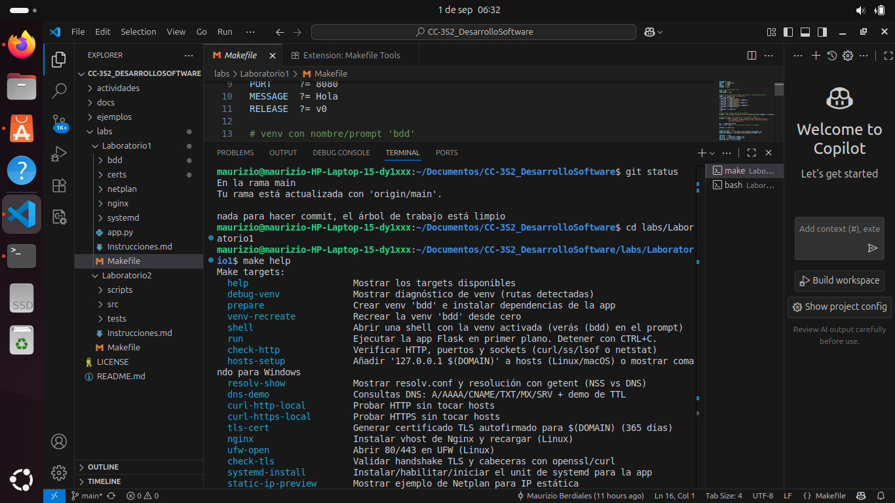
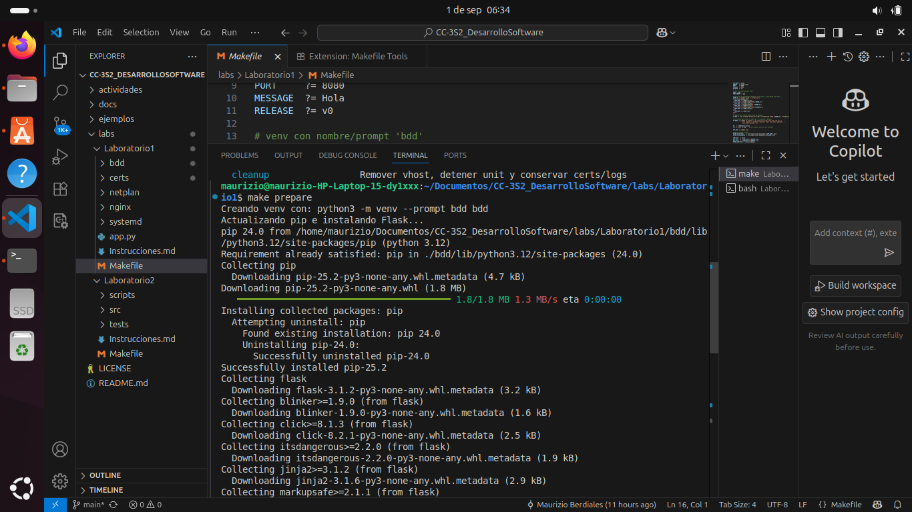
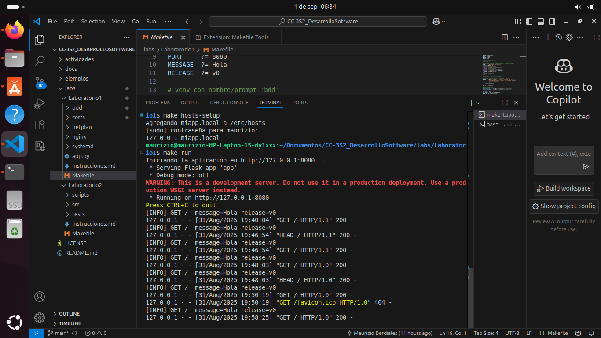
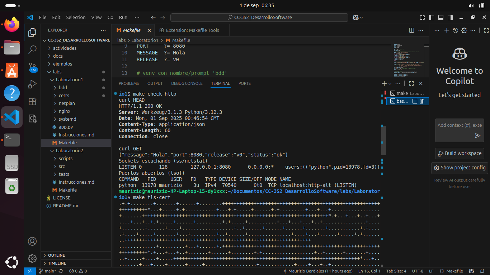
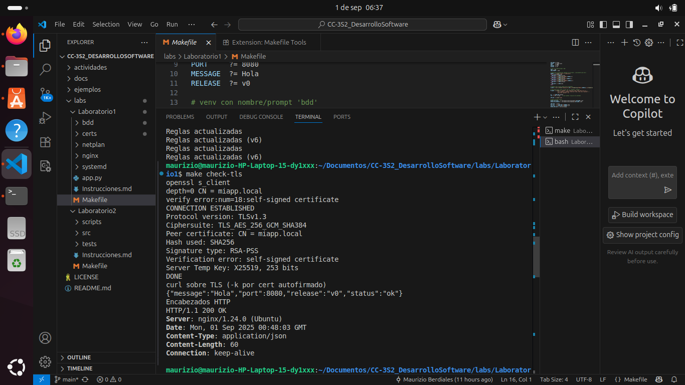
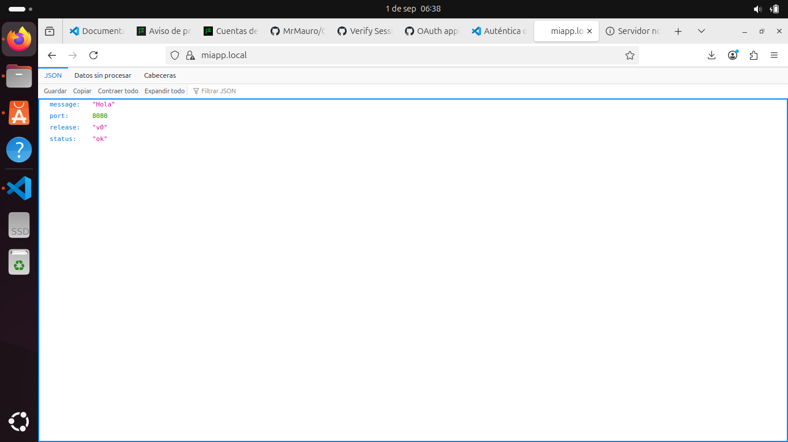

# Laboratorio 1
## Resolución

En este laboratorio trabajamos con la automatización de despliegues y la configuración de acceso a una aplicación local. 

Primero, utilizamos `make` para simplificar y atender a la necesidad de **despliegues continuos**. Esto nos permitió ejecutar de manera automatizada comandos de compilación, ejecución y configuración del proyecto.

Además, generamos un **certificado autofirmado**, el cual nos permite habilitar conexiones seguras mediante el protocolo **HTTPS**, incluso en entornos locales de prueba.

La aplicación quedó corriendo en el puerto **`localhost:8080`**, lo que nos permitió verificar su funcionamiento de forma directa. El DNS se configura automáticamente para resolver el nombre personalizado **`miapp.local`**, logrando acceder a la aplicación usando dicho dominio en lugar de la dirección por defecto.

En resumen, logramos:
- Automatizar el despliegue con `make`.
- Generar un certificado autofirmado para HTTPS.
- Levantar la aplicación en `localhost:8080`.
- Acceder mediante un dominio local personalizado: `miapp.local`.

A continuación se muestran las capturas de las pruebas realizadas:

**Figura 1.** Estado inicial del repositorio con `git status` y ayuda de `make`  

**Figura 2.** Ejecución de `make prepare`  

**Figura 3.** Ejecución de `make run`  

**Figura 4.** Generación de certificado autofirmado con `make cert`  

**Figura 5.** Verificación con `make check`  

**Figura 6.** Prueba de ejecución con `app run`  

